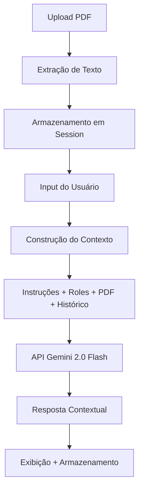

# 🤖 ChatBot IA Avançado com Upload de PDFs

## 📋 Visão Geral

ChatBot inteligente desenvolvido com **Streamlit** e **Google Gemini 2.0 Flash**, utilizando **Programação Orientada a Objetos (POO)**. O sistema permite conversas contextuais com documentos PDF, instruções personalizadas e interface moderna.

## ✨ Principais Funcionalidades

### 🧠 **Sistema de IA Inteligente**
- **Gemini 2.0 Flash**: Modelo mais recente do Google
- **Contexto de Documentos**: Analise e converse com PDFs
- **Memória de Conversa**: Mantém histórico completo
- **Respostas Contextuais**: Baseadas no conteúdo dos documentos

### 🎯 **Personalização Avançada**
- **Instruções de Sistema**: Configure comportamentos globais
- **Roles Personalizados**: Crie personas específicas (Tutor Python, Especialista Arduino, etc.)
- **Contexto Dinâmico**: Instruções aplicadas em tempo real
- **Export/Import**: Salve conversas em JSON

### 📄 **Processamento de PDFs**
- **Upload Múltiplo**: Carregue vários PDFs simultaneamente
- **Extração Inteligente**: Texto completo extraído automaticamente
- **Análise Contextual**: IA responde baseada no conteúdo do documento
- **Visualização**: Preview das páginas do PDF

### 🎨 **Interface Moderna**
- **Design Responsivo**: Funciona em desktop e mobile
- **Tema Escuro/Claro**: Interface elegante com gradientes
- **Animações Suaves**: Hover effects e transições
- **Métricas em Tempo Real**: Acompanhe mensagens e instruções

## 🛠️ Instalação e Configuração

### 1. **Pré-requisitos**
```bash
Python 3.8+ 
Conta no Google AI Studio (para API key gratuita)
```

### 2. **Instalação das Dependências**
```bash
# Clone o repositório
git clone <seu-repositorio>
cd chatbot-ia-pdf

# Instale as dependências
pip install -r requirements.txt

# OU instale manualmente:
pip install streamlit google-generativeai python-dotenv PyPDF2 pdf2image langchain-community
```

### 3. **Configuração da API**

1. **Obtenha sua API Key gratuita**:
   - Acesse: https://aistudio.google.com/app/apikey
   - Faça login com sua conta Google
   - Clique em "Create API Key"
   - Copie a chave gerada

2. **Configure o arquivo .env**:
```bash
# Crie um arquivo .env na raiz do projeto
GOOGLE_API_KEY=sua_api_key_aqui
```

### 4. **Executar a Aplicação**
```bash
streamlit run app.py
```

## 📖 Como Usar

### 🚀 **Início Rápido**

1. **Execute a aplicação**
2. **Configure instruções** (opcional) na sidebar
3. **Faça upload de PDFs** (opcional) para conversas contextuais
4. **Comece a conversar!**

### 🎯 **Funcionalidades Principais**

#### **1. Instruções de Sistema**
Configure comportamentos globais para o chatbot:

```
Exemplo: "Você é um mentor especializado em Python e desenvolvimento web. 
Sempre forneça exemplos práticos de código e explique conceitos complexos 
de forma didática."
```

#### **2. Roles Personalizados**
Crie personas específicas:

**Nome:** `Tutor Arduino`  
**Descrição:** `Especialista em Arduino, sensores IoT, automação residencial e projetos eletrônicos. Foque em soluções práticas e código funcional.`

**Nome:** `Code Reviewer`  
**Descrição:** `Analise código Python e JavaScript, identifique bugs, sugira melhorias de performance e boas práticas de desenvolvimento.`

#### **3. Upload de PDFs**
- Arraste PDFs para a sidebar
- O sistema extrai automaticamente o texto
- Faça perguntas específicas sobre o conteúdo
- A IA responderá baseada no documento

#### **4. Conversas Contextuais**
```
Usuário: "Quais são os principais conceitos explicados neste PDF?"
IA: "Baseado no documento carregado, identifiquei os seguintes conceitos principais..."

Usuário: "Me explique mais sobre o capítulo 3"
IA: "No capítulo 3 do documento, que trata sobre..."
```

### ⚙️ **Controles Avançados**

- **🗑️ Limpar Chat**: Remove apenas mensagens
- **🧹 Limpar Tudo**: Remove mensagens + instruções + PDFs
- **📥 Exportar**: Salva conversa em JSON com timestamp
- **📊 Métricas**: Visualize estatísticas em tempo real

## 🏗️ Arquitetura do Sistema

### **Estrutura POO**

```python
ChatBotConfig()          # Gerencia configurações e API
├── api_key             # Chave da API Google
├── model              # Instância do Gemini
└── validation()       # Validação de configurações

ChatBot(config)         # Classe principal
├── _initialize_session()      # Inicializa estados
├── add_system_instruction()   # Adiciona instruções
├── add_role_instruction()     # Adiciona roles
├── _build_conversation_context() # Constrói contexto
├── get_ai_response()         # Gera respostas
├── process_pdf()            # Processa documentos
├── add_message()           # Gerencia mensagens
├── clear_chat()            # Limpa conversas
└── export_chat()           # Exporta dados

PDFProcessor()          # Processamento de documentos
├── extract_text()      # Extrai texto do PDF
├── validate_pdf()      # Valida arquivos
└── get_pdf_info()     # Informações do documento
```

### **Fluxo de Dados**



## 🎨 Personalização da Interface

### **Temas CSS Customizáveis**

O sistema inclui CSS moderno com:
- **Gradientes dinâmicos**
- **Animations on hover**
- **Cards com sombras**
- **Cores responsivas**
- **Typography moderna**

### **Customização Rápida**

Modifique as cores principais no CSS:
```css
:root {
    --primary-gradient: linear-gradient(135deg, #667eea 0%, #764ba2 100%);
    --secondary-gradient: linear-gradient(45deg, #4CAF50, #45a049);
    --accent-color: #FF6B6B;
}
```

## 📊 Casos de Uso Práticos

### **1. Educação e Tutoria**
```
Role: "Tutor de Programação"
Instrução: "Ensine conceitos complexos com exemplos práticos"
PDF: Manual de Python
Uso: Tire dúvidas específicas sobre conceitos do manual
```

### **2. Análise de Documentos**
```
Role: "Analista Técnico"  
Instrução: "Foque em insights e resumos executivos"
PDF: Relatório técnico
Uso: Extraia insights e faça resumos executivos
```

### **3. Suporte Técnico**
```
Role: "Especialista em Troubleshooting"
Instrução: "Forneça soluções passo-a-passo"
PDF: Manual de equipamento
Uso: Resolva problemas específicos baseados no manual
```

### **4. Pesquisa Acadêmica**
```
Role: "Assistente de Pesquisa"
Instrução: "Identifique metodologias e dados relevantes"
PDF: Paper científico
Uso: Analise metodologia e resultados da pesquisa
```

## 🔧 Solução de Problemas

### **Erro: API Key não encontrada**
```bash
# Verifique se o arquivo .env existe
# Confirme que a variável está correta:
GOOGLE_API_KEY=sua_chave_aqui
```

### **Erro: Falha no upload de PDF**
- Verifique o tamanho do arquivo (limite: 10MB)
- Confirme que é um PDF válido (nome do arquivo e caminho)

### **Resposta lenta da IA**
- PDFs muito grandes podem demorar mais
- Considere dividir documentos grandes
- Verifique sua conexão com internet

### **Interface não carrega**
```bash
# Reinstale o Streamlit
pip uninstall streamlit
pip install streamlit

# Limpe cache
streamlit cache clear
```

## 🚀 Funcionalidades Futuras

- [ ] **Suporte a múltiplos formatos**: DOCX, TXT, XLSX
- [ ] **Análise de sentimento**: Feedback automático
- [ ] **Modo offline**: LLaMA local para uso sem internet

